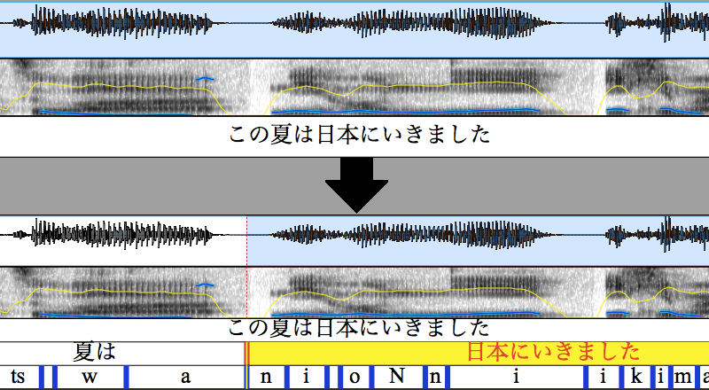

# pyJuliusAlign

 [](https://gitter.im/pyJuliusAlign/Lobby?utm_source=badge&utm_medium=badge&utm_campaign=pr-badge&utm_content=badge) [](http://opensource.org/licenses/MIT) [](https://pypi.org/project/pyjuliusalign/)

*Questions?  Comments?  Feedback?  Chat with us on gitter!*

-----

Input and output of pyJuliusAlign:



録音音声とトランスクリプトはあるけど、どこにその単語またはその子音、母音があるのか正確に分からない時、それらを探すために「forced alignment」という機能を使います。「Julius」という音声認識システムは日本語で「forced alignment」を行うことができますが、音声内に発音を入れる必要があります。がしかし、基本的にはトランスクリプトは文字だけです。「cabocha」というソフトウェアは文章を元にそれぞれの単語からその発音まで変換することができます。「pyJuliusAlign」というライブラリは日本語を「forced alignment」する為に「Julius」と「cabocha」を一緒に使います。TextGridされた音声録音には、単語とその子音、母音を直接挿入することができます。

When we have a speech recording and a text transcript but we don't know where the words, vowels, and consonants are, we can use a tool called "forced alignment" to find them. There is a speech recognition system called "Julius" that can do forced alignment in Japanese. However, it requires the pronunciation used in the recording. Usually, in the text transcript, there is only words. The "Cabocha" software can convert sentences to individual words and their pronunciations. The software library "pyJuliusAlign" uses "Julius" and "cabocha" together. In textgrid speech transcripts, words, vowels, and consonants can be directly inserted.

----

英語やフランス語やスペイン語など「forced alignment」をしたいなら「SPPAS」と言うソフトウェアをお勧めします。

If you want to do forced alignment in English, French, or Spanish, I recommend SPPAS.

[http://www.sppas.org](http://www.sppas.org/)


----

To get started:

*/examples/align_example.py* should be sufficient for a large number of cases.

*/pyjuliusalign/alignFromTextgrid.py* provides a good example of building your own custom alignment code (with different inputs and outputs than textgrids).  


# Table of contents
1. [Major Revisions](#major-revisions)
2. [Requirements](#requirements)
  * [Mac-specific Requirements Information](#mac-specific-requirements-information)
  * [Windows-specific Requirements Information](#windows-specific-requirements-information)
3. [Installation](#installation)
4. [Testing Installation](#testing-installation)
5. [Example Usage](#example-usage)
6. [Troubleshooting](#troubleshooting)


## Major Revisions

Ver 3.0.0 (October 11, 2020)
- Fixed a bug preventing the use of triphone models.
- Requires a new python library (python-Levenshtein)

Ver 2.0 (January 12, 2019)
- pyJuliusAlign now works with the latest version of Julius and the Julius Segmentation Kit.
  - If you need to use the old segmentation kit (segment_julius4.pl), please use pyJuliusAlign ver 1.1 
- Quality of life improvements + documentation

Ver 1.1 (August 12, 2018)
- Python 3.x support

Ver 1.0 (September 2, 2014)
- Users can force-align words and phones for transcribed speech in Japanese


## Requirements

python - https://www.python.org/

python-Levenshtein
- https://github.com/ztane/python-Levenshtein

praatIO - https://github.com/timmahrt/praatIO
 - for textgrid manipulations

Julius - https://github.com/julius-speech/julius
 - the speech recognition engine
 - pyJuliusAlign has been tested with Julius 4.5, released on January 2nd, 2019.

Julius Segmentation Kit - https://github.com/julius-speech/segmentation-kit
 - it's not a file you "install" but something you'll want to put in a stable folder where you can access it when needed
 - Change line 33 to:
  ```perl
  ## data directory
  $datadir = "./wav";
  if (defined $ARGV[0]) {
    $datadir = $ARGV[0];
  }
  ```
  - Also in the configuration section, I recommend setting `$hmmdefs` to an absolute path e.g. `$hmmdefs="/Users/tmahrt/segmentation-kit/models/hmmdefs_monof_mix16_gid.binhmm"; # monophone model`
  - Make sure to set silence appropriately.  If you have clearly marked the edges of speech, you'll want to turn off silence marking.  If you have not done so (for example, your recording only includes a single utterance) then you'll want to have the segmentation kit expect silence at the start and end of your recording.

Sox - http://sox.sourceforge.net/
 - Converts the sampling frequency of the audio if needed.
 - Optional.  If you choose to not install sox, you'll need to make sure your audio files are at the same sampling frequency as the model data (the included data is 14khz)
 - If you forced the script to run Julius on audio that has a different sampling frequency, the aligner would completely fail.

Cabocha - http://taku910.github.io/cabocha/ 
 - used to convert typical Japanese text into romaji/phones.
 - (throw it into google translate if you need it in English)
 - make a note of which encoding you use for the dictionary file--you'll need it in the code

Perl (for Julius)


### Mac-specific Requirements Information

I use a mac and was able to easily install many requirements using Homebrew.  Here are some guides that I found useful (they translate well enough from Japanese using google translate):
 - Sox https://qiita.com/samurai20000@github/items/2af98b6c468af317bb09
 - Cabocha https://qiita.com/musaprg/items/9a572ad5c4e28f79d2ae
 - I manually built Julius using the configure and make scripts included in that project


### Windows-specific Requirements Information

I currently don't have access to a Windows machine. Earlier, I tested installation and got as far as running Julius. Perl tried to run gzip which I couldn't get to install.

One user was able to get it working on Windows by installing cygwin and adding cygwin to the path in environment variables.  Also, they had to install MeCab before running Cabocha, otherwise, they would receive an exception saying there's something wrong with Cabocha.


## Installation

PyJuliusAlign is on pypi and can be installed or upgraded from the command-line shell with pip like so::

    python -m pip install pyjuliusalign --upgrade

Otherwise, to manually install, after downloading the source from github, from a command-line shell, navigate to the directory containing setup.py and type::

    python setup.py install

If python is not in your path, you'll need to enter the full path e.g.::

	C:\Python36\python.exe setup.py install


## Testing Installation

In the folder 'examples' run the file 'align_example.py'.

If sox, cabocha, julius, and perl are all in your path, you won't need to specify them in any of the arguments--leave them with your default values. Otherwise, you'll need to specify the full path of their bin/executable files.

If you have difficulties running the code without specifying the full path, try using the full paths anyways.

Also, you will need to configure "segment_julius.pl" which is a part of the Julius Segmentation Kit.


## Example Usage

Please see /examples for an example usage.

There is pretty much only one way to use this library at the moment. Please contact me if you are having difficulties using this library.


## Troubleshooting

The scripts should catch any issues along the way with the exception of  issues stemming from Julius.  If you get bogus/null results, most likely Julius hasn't been set up correctly.

The Julius Segmentation kit comes with an example.  If you can force align that, then you should be able to force align using this script as well.


